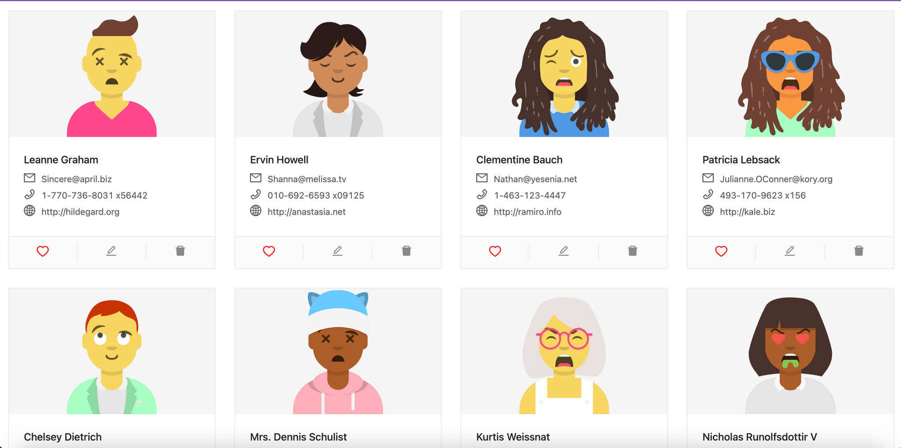

# React Coding Assignment

This project was bootstrapped with [Create React App](https://github.com/facebook/create-react-app).

## Description 
* Tech stack: 
  - [React](https://reactjs.org/)
  - [TypeScript](https://www.typescriptlang.org/)
  - [Ant Design](https://ant.design/docs/react/introduce)
  - [Axios for api calls](https://www.npmjs.com/package/axios)
* TDD: Unit tests included using [react testing library](https://testing-library.com/docs/react-testing-library/intro/)
* To execute tests run: `npm run test` in the root of the project

## Demo Link:

## Available Scripts

In the project directory, you can run:

### `npm start`

Runs the app in the development mode.\
Open [http://localhost:3000](http://localhost:3000) to view it in the browser.

### `npm run test`
Launches the test runner in the interactive watch mode.

### `npm run build`

Generates `build` folder at the root of the project

## Documentation
[See details in docs directory](https://iruuzainc.notion.site/React-Coding-Assignment-d55c556b441a45c7b3cc57ce217e6e8b)

[Visit live Demo at: ](https://iruuzainc.notion.site/React-Coding-Assignment-d55c556b441a45c7b3cc57ce217e6e8b)
